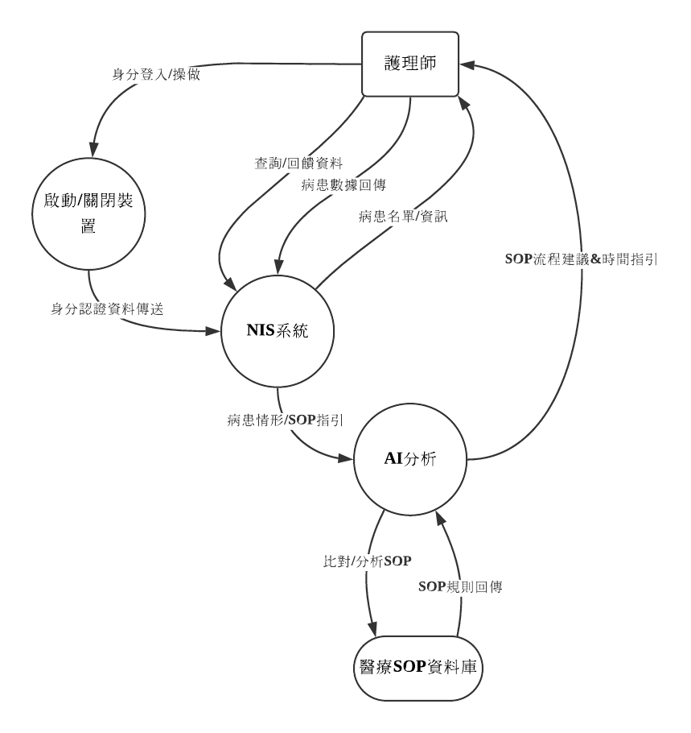

# 1. 系統環境圖 (DFD)

## 外部實體
- 護理師：系統終端使用者，負責登入、查詢/接收資訊、操作全流程。

## 處理程序
- 啟動/關閉裝置：設備開關及使用者身份認證。
- NIS系統：彙整病患資料流、查詢、指引病患情形，核心數據交換站。
- AI分析：依據 NIS資料，自動分析病患狀況，執行 SOP 比對與建議。

## 資料庫
- 醫療SOP資料庫：存放所有醫療作業標準流程(SOP)規則，供 AI 查詢與分析。

## 資料流
- 身分登入／操作：護理師→啟動/關閉裝置
- 身分認證資料傳送：啟動/關閉裝置→NIS系統
- 查詢／回饋資料：護理師↔NIS系統
- 病患名單／資訊：NIS系統→護理師
- 病患數據回傳：護理師→NIS系統
- 病患情形／SOP指引：NIS系統→AI分析
- 比對／分析SOP：AI分析→醫療SOP資料庫
- SOP規則回傳：醫療SOP資料庫→AI分析
- SOP流程建議&時間指引：AI分析→護理師

---

# 2. DFD 圖0

## 外部實體
- 使用者：流程起點，觸發啟動裝置。

## 處理程序
- 啟動裝置：開啟系統設備。
- 身分識別：進行身份驗證。
- 查閱病患資料：檢索並顯示資料庫病人資訊。
- 等待/查閱其他病患：流程迴圈，暫停或轉查詢下位病患。
- AI分析與SOP對比：根據查詢自動分析並找出合適 SOP。
- 顯示SOP流程與時序：指引標準作業流程及時間。
- 紀錄病患數據：將相關治療結果數據寫入資料庫。
- 關閉裝置：終止本輪流程，設備安全下線。

## 判斷/決策節點
- 是否需治療？
- 是否處理下一病患？

## 資料庫
- 今日需檢查病患：病患清單資料庫。
- 醫療SOP資料庫：標準作業規則資料庫。

## 資料流
- 啟動裝置→身分識別
- 身分識別→今日需檢查病患
- 今日需檢查病患→查閱病患資料
- 查閱病患資料→是否需治療判斷
- 判斷結果→等待/查閱其他病患 或 AI分析與SOP對比
- AI分析與SOP對比→顯示SOP流程與時序
- 顯示SOP流程與時序→是否處理下一病患判斷
- 是否處理下一病患→關閉裝置 或 返回今日需檢查病患
- 顯示SOP流程與時序→紀錄病患數據
- 紀錄病患數據→今日需檢查病患
- AI分析與SOP對比↔醫療SOP資料庫

