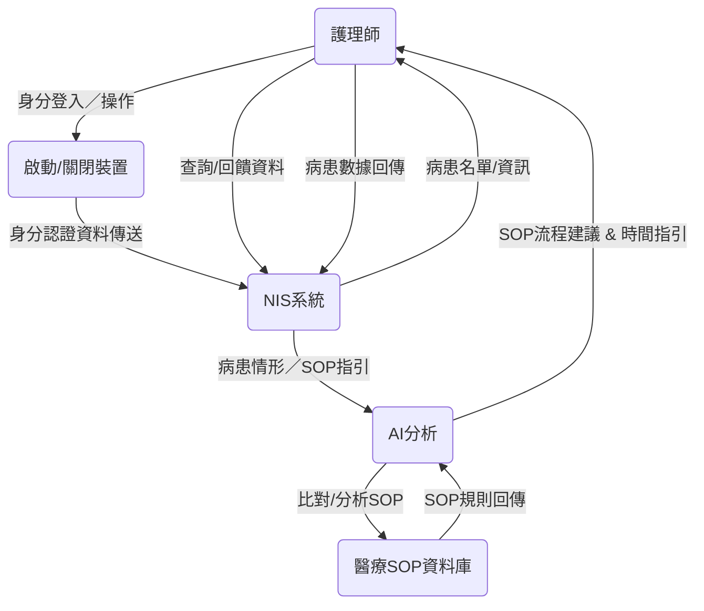
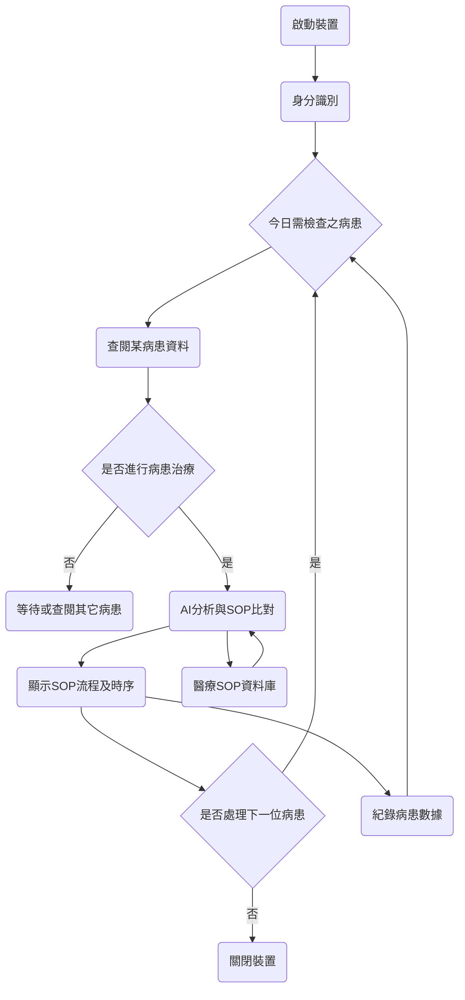

系統環境圖 (DFD)
.png)

```mermaid
flowchart TD
    Nurse(護理師) -->|身分登入／操作| Device(啟動/關閉裝置)
    Device -- 身分認證資料傳送 --> NIS(NIS系統)
    Nurse -- 查詢/回饋資料 --> NIS
    NIS -- 病患名單/資訊 --> Nurse
    Nurse -- 病患數據回傳 --> NIS
    NIS -- 病患情形／SOP指引 --> AI( AI分析 )
    AI -- 比對/分析SOP --> SOPDB(醫療SOP資料庫)
    SOPDB -- SOP規則回傳 --> AI
    AI -- SOP流程建議 & 時間指引--> Nurse

```

```mermaid
flowchart TD
    A(啟動裝置) --> B(身分識別)
    B --> D{今日需檢查之病患}
    D --> E(查閱某病患資料)
    E --> F{是否進行病患治療}
    F -- 否 --> K(等待或查閱其它病患)
    F -- 是 --> G(AI分析與SOP比對)
    G --> H(顯示SOP流程及時序)
    H --> I{是否處理下一位病患}
    I -- 否 --> J(關閉裝置)
    I -- 是 --> D
    H --> L(紀錄病患數據)
    L --> D
    G --> M(醫療SOP資料庫)
    M --> G
```
